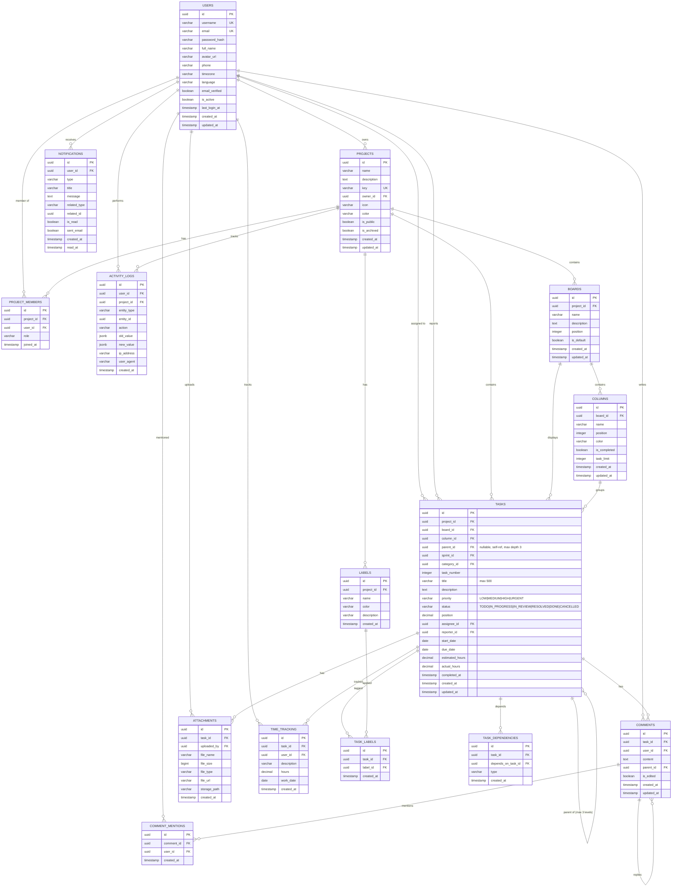

# Taskoryx - Entity Relationship Diagram

## 📊 Database ERD (Mermaid)



## 🔗 Key Relationships

### One-to-Many (1:N)
- **User → Projects**: Một user có thể sở hữu nhiều projects
- **User → Tasks**: Một user có thể được assign nhiều tasks
- **Project → Boards**: Một project có thể có nhiều boards
- **Board → Columns**: Một board có nhiều columns
- **Column → Tasks**: Một column chứa nhiều tasks
- **Task → Comments**: Một task có nhiều comments
- **Task → Attachments**: Một task có nhiều files

### Many-to-Many (N:M)
- **Users ↔ Projects**: Qua bảng `project_members`
- **Tasks ↔ Labels**: Qua bảng `task_labels`
- **Tasks ↔ Tasks**: Qua bảng `task_dependencies` (self-referencing)

### Self-Referencing
- **Comments → Comments**: Comment có thể reply comment khác (parent_id)
- **Tasks → Tasks (dependencies)**: Task có thể phụ thuộc vào task khác (task_dependencies)
- **Tasks → Tasks (hierarchy)**: Task có thể là con của task khác qua `parent_id`, tối đa 3 cấp

## 📌 Important Constraints

### Unique Constraints
1. `users.email` - Email phải duy nhất
2. `users.username` - Username phải duy nhất
3. `projects.key` - Project key phải duy nhất (VD: TASK, PROJ)
4. `(project_id, task_number)` - Task number duy nhất trong project
5. `(project_id, user_id)` - User chỉ có 1 role trong 1 project
6. `(task_id, label_id)` - Mỗi label chỉ gắn 1 lần cho task

### Task Hierarchy Constraints
- `tasks.parent_id` là nullable self-FK → `tasks.id`
- Index `idx_tasks_parent` trên cột `parent_id`
- Giới hạn tối đa 3 cấp được enforce ở tầng **service** (không phải DB constraint)
- Không cho phép vòng lặp — detect bằng DFS trong `TaskService.isDescendant()`

### Foreign Key Actions
- **ON DELETE CASCADE**: Xóa parent → xóa children
  - Projects → Boards, Tasks, Labels
  - Tasks → Comments, Attachments
  - Comments → Mentions

- **ON DELETE RESTRICT**: Không cho xóa parent nếu còn children
  - Projects (owner_id) - Phải transfer ownership trước
  - Tasks (reporter_id) - Không được xóa người tạo task
  - Columns - Phải move tasks ra khỏi column trước

- **ON DELETE SET NULL**: Xóa parent → set NULL cho children
  - Tasks (assignee_id) - Unassign task khi xóa user

## 🎯 Design Decisions

### 1. UUID vs Auto-increment ID
- ✅ **UUID**: Dùng cho tất cả primary keys
- **Lý do**:
  - Tốt cho distributed systems
  - Khó đoán/enumerate
  - Không conflict khi merge databases
  - Phù hợp với microservices architecture

### 2. Task Numbering
- Format: `{PROJECT_KEY}-{NUMBER}` (VD: TASK-123)
- `task_number` là integer, auto-increment trong project
- Display format được tạo từ `project.key + task.task_number`

### 3. Task Position (Decimal)
- Dùng DECIMAL thay vì INTEGER
- **Lý do**: Dễ reorder tasks mà không cần update nhiều rows
  - Insert giữa task 1 và 2: position = 1.5
  - Insert giữa 1.5 và 2: position = 1.75
- Định kỳ "normalize" positions khi cần

### 4. JSONB for Activity Logs
- Lưu old_value và new_value dạng JSONB
- **Lý do**: Flexible schema, có thể query/index JSONB fields

### 5. Soft Delete vs Hard Delete
- **Hard Delete**: Dùng cho hầu hết entities
- **Soft Delete** (is_archived): Chỉ dùng cho Projects
- **Lý do**: Projects quan trọng, nên archive thay vì xóa

## 📈 Scalability Considerations

### Indexing Strategy
- Index tất cả Foreign Keys
- Composite index cho queries thường dùng:
  - `(project_id, task_number)`
  - `(column_id, position)`
  - `(user_id, is_read)` cho notifications

### Partitioning (Future)
- `activity_logs`: Partition by month/quarter
- `notifications`: Partition by created_at
- **Khi nào**: Khi table > 10M rows

### Archiving (Future)
- Move old data sang archive tables
- `activity_logs` > 1 year old
- `notifications` > 6 months old và đã read

## 🔍 Query Patterns

### Common Queries

#### 1. Get all tasks in a column
```sql
SELECT * FROM tasks
WHERE column_id = ?
ORDER BY position ASC;
```

#### 2. Get user's tasks
```sql
SELECT t.*, p.key, p.name as project_name
FROM tasks t
JOIN projects p ON t.project_id = p.id
WHERE t.assignee_id = ?
ORDER BY t.due_date ASC;
```

#### 3. Get project members with roles
```sql
SELECT u.*, pm.role
FROM users u
JOIN project_members pm ON u.id = pm.user_id
WHERE pm.project_id = ?;
```

#### 4. Get task with all details
```sql
SELECT
    t.*,
    p.key || '-' || t.task_number as task_key,
    assignee.full_name as assignee_name,
    reporter.full_name as reporter_name,
    array_agg(l.name) as labels
FROM tasks t
JOIN projects p ON t.project_id = p.id
LEFT JOIN users assignee ON t.assignee_id = assignee.id
LEFT JOIN users reporter ON t.reporter_id = reporter.id
LEFT JOIN task_labels tl ON t.id = tl.task_id
LEFT JOIN labels l ON tl.label_id = l.id
WHERE t.id = ?
GROUP BY t.id, p.id, assignee.id, reporter.id;
```

## 🛠️ Maintenance

### Regular Tasks
1. **Vacuum**: Weekly
   ```sql
   VACUUM ANALYZE;
   ```

2. **Reindex**: Monthly
   ```sql
   REINDEX DATABASE taskoryx_prod;
   ```

3. **Update Statistics**: Weekly
   ```sql
   ANALYZE;
   ```

4. **Check Table Sizes**:
   ```sql
   SELECT
       schemaname,
       tablename,
       pg_size_pretty(pg_total_relation_size(schemaname||'.'||tablename)) AS size
   FROM pg_tables
   WHERE schemaname = 'public'
   ORDER BY pg_total_relation_size(schemaname||'.'||tablename) DESC;
   ```

---

**Version**: 1.0.0
**Last Updated**: 2025-02-05
